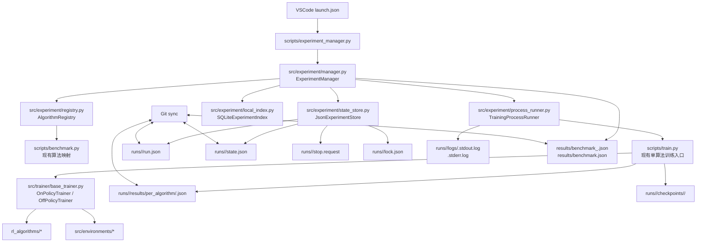
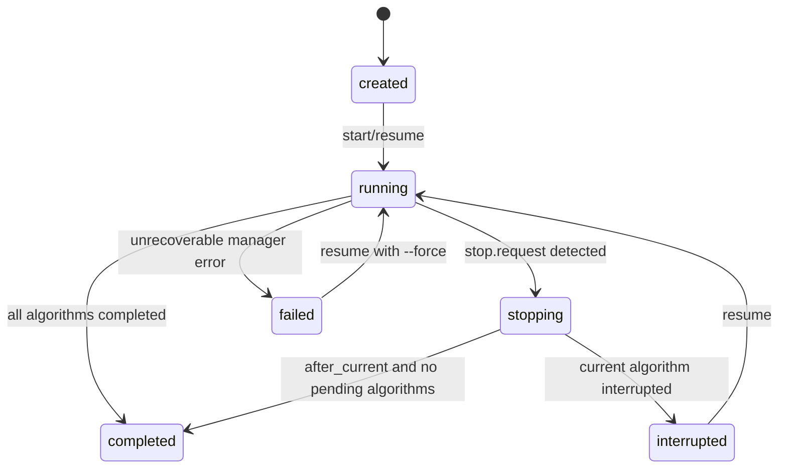
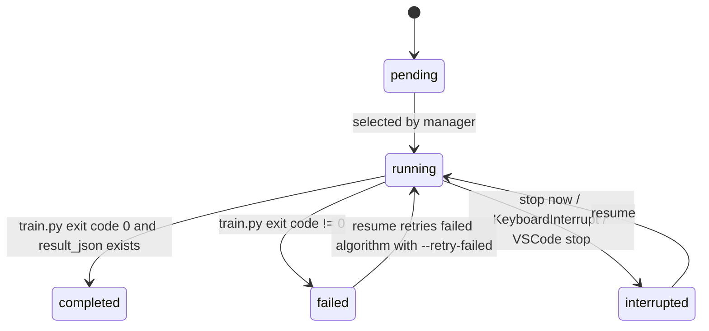

# 系统架构设计

## 1. 架构总览

### 1.1 项目背景

项目名称：`paper2` / `grpo-mec`  
项目性质：已有 Python 强化学习算法对比框架，在现有 VSCode 调试训练平台上新增“可中断、可恢复、可跨设备接力执行”的算法对比实验能力。  
运行环境：两台 Windows 设备，其中一台有 GPU，一台无 GPU。  
核心入口：VSCode 调试配置一键启动、恢复、停止、查看状态。  
跨设备协作方式：通过 Git 同步实验状态元数据。  
保存粒度：算法级。已经完成的算法保留并跳过；正在运行但未完成的算法不要求精确恢复，resume 时重新执行该算法。  
并发要求：不并行多个算法；一次只运行一个算法。  

### 1.2 总体方案

采用 **轻量实验编排器 + Git-friendly JSON 状态清单 + 可选本地 SQLite 索引 + VSCode 调试入口**。

新增 `scripts/experiment_manager.py` 作为统一 CLI 入口，负责：

1. 创建可恢复 benchmark run。
2. 读取 `run.json` / `state.json`。
3. 选择第一个未完成算法。
4. 通过 subprocess 调用现有 `scripts/train.py`。
5. 每个算法完成后写入算法级结果、更新兼容的 benchmark JSON、将算法状态置为 `completed`。
6. 收到 stop 请求时终止当前训练进程或停止启动下一个算法。
7. 在另一台设备 `git pull` 后继续执行未完成算法。

权威状态源使用文本 JSON，便于 Git 同步和冲突审查。SQLite 只作为本地缓存和查询索引，不进入 Git，不作为跨设备状态源。

### 1.3 架构图



### 1.4 关键设计决策

| 决策 | 结论 | 原因 |
|---|---|---|
| 分布式方式 | 不引入 Ray，不做 DDP | 用户不需要并行多个算法；只需要不同算法阶段在不同设备/时间上接力 |
| 状态源 | `run.json` + `state.json` | JSON 可读、可 Git 同步、冲突可审查 |
| SQLite | 本地可选索引，默认不提交 | SQLite 二进制文件不适合 Git 合并 |
| resume 粒度 | 算法级 resume | 用户明确不要求正在运行算法精确恢复 |
| 当前算法中断 | 标记 `interrupted`，下次重跑 | 保证 benchmark 队列不会从头开始，同时避免复杂 checkpoint 协议 |
| 训练调用方式 | subprocess 调用 `scripts/train.py` | 最大化复用现有训练逻辑，降低侵入性 |
| VSCode 集成 | `.vscode/launch.json` 一键 start/resume/stop/status | 符合用户偏好 |
| 结果兼容 | 保持写入 `results/benchmark.json` 与 timestamp/run_id JSON | 不破坏现有 `results/benchmark*.json` 使用方式 |

---

## 2. 模块划分

### 模块 A：实验数据模型 `src/experiment/models.py`

#### 职责

定义实验配置、实验状态、算法记录、设备信息、停止请求、进程信息等核心数据结构。

#### 输入

- CLI 参数：算法列表、timesteps、seed、device、scale、run_id。
- `run.json` / `state.json` 内容。
- 子进程退出码、输出结果路径。

#### 输出

- 标准化 Python dataclass 对象。
- 可序列化 JSON dict。

#### 依赖

- Python 标准库：`dataclasses`、`datetime`、`typing`、`pathlib`。
- 不依赖 torch、gymnasium、训练器，避免状态层与训练层耦合。

#### 核心类/接口

- `AlgorithmStatus`
  - 类型：`Literal["pending", "running", "completed", "failed", "interrupted", "skipped"]`
  - 职责：约束算法状态枚举。

- `DeviceInfo`
  - 字段：
    - `hostname: str`
    - `platform: str`
    - `python_version: str`
    - `device_arg: str`
    - `torch_cuda_available: bool`
    - `torch_cuda_device_count: int`
    - `git_commit: str | None`
  - 方法：
    - `@classmethod collect(device_arg: str) -> "DeviceInfo"`：采集当前设备信息。
    - `to_dict() -> dict`：转 JSON dict。
    - `@classmethod from_dict(data: dict) -> "DeviceInfo"`：从 JSON dict 还原。

- `AlgorithmRunRecord`
  - 字段：
    - `name: str`
    - `index: int`
    - `status: AlgorithmStatus`
    - `config_path: str`
    - `env: str`
    - `seed: int`
    - `timesteps: int`
    - `device: str`
    - `save_dir: str`
    - `result_json: str`
    - `started_at: str | None`
    - `finished_at: str | None`
    - `last_exit_code: int | None`
    - `error: str | None`
    - `completed_by: dict | None`
  - 方法：
    - `mark_running(device: DeviceInfo, started_at: str) -> None`
    - `mark_completed(device: DeviceInfo, finished_at: str, result_json: str) -> None`
    - `mark_failed(device: DeviceInfo, finished_at: str, exit_code: int, error: str) -> None`
    - `mark_interrupted(device: DeviceInfo, finished_at: str, exit_code: int | None, reason: str) -> None`
    - `to_dict() -> dict`
    - `@classmethod from_dict(data: dict) -> "AlgorithmRunRecord"`

- `ExperimentRunConfig`
  - 字段：
    - `schema_version: int`
    - `run_id: str`
    - `created_at: str`
    - `project: str`
    - `mode: str`
    - `algorithms: list[str]`
    - `timesteps: int`
    - `seed: int`
    - `device_policy: str`
    - `runs_dir: str`
    - `results_dir: str`
    - `scale: str | None`
    - `extra_args: list[str]`
    - `output_compatibility: dict`
  - 方法：
    - `to_dict() -> dict`
    - `@classmethod from_dict(data: dict) -> "ExperimentRunConfig"`

- `ExperimentState`
  - 字段：
    - `schema_version: int`
    - `run_id: str`
    - `status: Literal["created", "running", "stopping", "completed", "failed", "interrupted"]`
    - `current_algorithm: str | None`
    - `created_at: str`
    - `updated_at: str`
    - `algorithms: list[AlgorithmRunRecord]`
    - `history: list[dict]`
  - 方法：
    - `next_pending_algorithm() -> AlgorithmRunRecord | None`
    - `completed_algorithms() -> list[AlgorithmRunRecord]`
    - `is_complete() -> bool`
    - `append_history(event: str, payload: dict) -> None`
    - `to_dict() -> dict`
    - `@classmethod from_dict(data: dict) -> "ExperimentState"`

- `StopRequest`
  - 字段：
    - `requested_at: str`
    - `requested_by: dict`
    - `mode: Literal["now", "after_current"]`
    - `reason: str`
  - 方法：
    - `to_dict() -> dict`
    - `@classmethod from_dict(data: dict) -> "StopRequest"`

---

### 模块 B：JSON 状态存储 `src/experiment/state_store.py`

#### 职责

负责所有实验状态文件的读写、原子保存、锁文件管理、停止请求管理。

#### 输入

- `ExperimentRunConfig`
- `ExperimentState`
- `StopRequest`
- run 目录路径

#### 输出

- `runs/<run_id>/run.json`
- `runs/<run_id>/state.json`
- `runs/<run_id>/lock.json`
- `runs/<run_id>/stop.request`

#### 依赖

- `src/experiment/models.py`
- Python 标准库：`json`、`os`、`time`、`pathlib`、`tempfile`、`contextlib`

#### 核心类/接口

- `JsonExperimentStore`
  - 构造函数：`__init__(self, project_root: Path, runs_dir: str = "runs")`
  - 方法：
    - `run_dir(run_id: str) -> Path`
    - `run_config_path(run_id: str) -> Path`
    - `state_path(run_id: str) -> Path`
    - `lock_path(run_id: str) -> Path`
    - `stop_request_path(run_id: str) -> Path`
    - `create_run(config: ExperimentRunConfig, state: ExperimentState) -> None`
    - `load_run_config(run_id: str) -> ExperimentRunConfig`
    - `load_state(run_id: str) -> ExperimentState`
    - `save_state(state: ExperimentState) -> None`
    - `save_run_config(config: ExperimentRunConfig) -> None`
    - `atomic_write_json(path: Path, payload: dict) -> None`
    - `request_stop(run_id: str, request: StopRequest) -> None`
    - `read_stop_request(run_id: str) -> StopRequest | None`
    - `clear_stop_request(run_id: str) -> None`
    - `has_stop_request(run_id: str) -> bool`
    - `acquire_lock(run_id: str, device: DeviceInfo, stale_after_seconds: int = 21600) -> None`
    - `release_lock(run_id: str) -> None`
    - `list_runs() -> list[str]`

- `atomic_write_json(path: Path, payload: dict) -> None`
  - 行为：
    1. 写入同目录临时文件：`<name>.tmp`。
    2. `flush()` 并 `os.fsync()`。
    3. 使用 `os.replace(tmp, path)` 原子替换。
  - 目的：保证 Windows 上突然中断时不会留下半截 JSON。

- `ExperimentLockError(RuntimeError)`
  - 使用场景：检测到另一个设备/进程持有未过期 `lock.json`。

#### 文件格式

##### `run.json`

```json
{
  "schema_version": 1,
  "run_id": "benchmark_20260428_031500",
  "created_at": "2026-04-28T03:15:00",
  "project": "paper2",
  "mode": "resumable_benchmark",
  "algorithms": ["GRPO", "PPO", "SAC"],
  "timesteps": 100000,
  "seed": 42,
  "device_policy": "auto",
  "runs_dir": "runs",
  "results_dir": "results",
  "scale": "small",
  "extra_args": [],
  "output_compatibility": {
    "write_latest_alias": true,
    "latest_results_path": "results/benchmark.json",
    "run_results_path": "results/benchmark_benchmark_20260428_031500.json"
  }
}
```

##### `state.json`

```json
{
  "schema_version": 1,
  "run_id": "benchmark_20260428_031500",
  "status": "running",
  "current_algorithm": "PPO",
  "created_at": "2026-04-28T03:15:00",
  "updated_at": "2026-04-28T04:20:00",
  "algorithms": [
    {
      "name": "GRPO",
      "index": 0,
      "status": "completed",
      "config_path": "configs/algorithms/grpo.yaml",
      "env": "auto",
      "seed": 42,
      "timesteps": 100000,
      "device": "auto",
      "save_dir": "runs/benchmark_20260428_031500/checkpoints/GRPO",
      "result_json": "runs/benchmark_20260428_031500/results/per_algorithm/GRPO.json",
      "started_at": "2026-04-28T03:15:10",
      "finished_at": "2026-04-28T04:10:00",
      "last_exit_code": 0,
      "error": null,
      "completed_by": {
        "hostname": "gpu-laptop",
        "platform": "Windows-10",
        "python_version": "3.10.x",
        "device_arg": "auto",
        "torch_cuda_available": true,
        "torch_cuda_device_count": 1,
        "git_commit": "<sha>"
      }
    }
  ],
  "history": []
}
```

---

### 模块 C：本地 SQLite 索引 `src/experiment/local_index.py`

#### 职责

提供本地状态查询缓存，用于快速列出 run、状态、算法进度。SQLite 不作为跨设备权威状态源，不进入 Git。

#### 输入

- `runs/*/run.json`
- `runs/*/state.json`
- per-algorithm result JSON

#### 输出

- `.experiment/experiment_state.sqlite`

#### 依赖

- Python 标准库：`sqlite3`、`pathlib`、`json`
- `src/experiment/models.py`
- `src/experiment/state_store.py`

#### 核心类/接口

- `SQLiteExperimentIndex`
  - 构造函数：`__init__(self, db_path: Path)`
  - 方法：
    - `initialize() -> None`
    - `upsert_run(config: ExperimentRunConfig, state: ExperimentState) -> None`
    - `upsert_algorithm(run_id: str, record: AlgorithmRunRecord) -> None`
    - `rebuild_from_runs(store: JsonExperimentStore) -> None`
    - `list_runs() -> list[dict]`
    - `get_run_summary(run_id: str) -> dict | None`

#### 数据表

- `runs`
  - `run_id TEXT PRIMARY KEY`
  - `status TEXT NOT NULL`
  - `created_at TEXT NOT NULL`
  - `updated_at TEXT NOT NULL`
  - `algorithms_total INTEGER NOT NULL`
  - `algorithms_completed INTEGER NOT NULL`
  - `current_algorithm TEXT`

- `algorithm_runs`
  - `run_id TEXT NOT NULL`
  - `algorithm TEXT NOT NULL`
  - `idx INTEGER NOT NULL`
  - `status TEXT NOT NULL`
  - `started_at TEXT`
  - `finished_at TEXT`
  - `device_hostname TEXT`
  - `result_json TEXT`
  - `error TEXT`
  - `PRIMARY KEY(run_id, algorithm)`

---

### 模块 D：训练命令构建与子进程运行 `src/experiment/process_runner.py`

#### 职责

负责构造 `scripts/train.py` 命令、启动训练子进程、写 stdout/stderr 日志、响应 stop 请求、返回子进程结果。

#### 输入

- `ExperimentRunConfig`
- `AlgorithmRunRecord`
- `DeviceInfo`
- `StopRequest`

#### 输出

- 子进程退出码
- stdout/stderr 日志
- per-algorithm result JSON
- 进程状态

#### 依赖

- Python 标准库：`subprocess`、`signal`、`os`、`sys`、`time`、`pathlib`
- Windows 支持：`subprocess.CREATE_NEW_PROCESS_GROUP`

#### 核心类/接口

- `TrainingCommandBuilder`
  - 构造函数：`__init__(self, project_root: Path)`
  - 方法：
    - `build_train_command(config: ExperimentRunConfig, record: AlgorithmRunRecord) -> list[str]`
  - 输出示例：

```bash
python scripts/train.py \
  --config configs/algorithms/grpo.yaml \
  --algorithm GRPO \
  --env auto \
  --timesteps 100000 \
  --seed 42 \
  --device auto \
  --save-dir runs/benchmark_20260428_031500/checkpoints/GRPO \
  --result-json runs/benchmark_20260428_031500/results/per_algorithm/GRPO.json
```

- `TrainingProcessResult`
  - 字段：
    - `algorithm: str`
    - `exit_code: int`
    - `started_at: str`
    - `finished_at: str`
    - `stdout_log: str`
    - `stderr_log: str`
    - `result_json: str`
    - `interrupted: bool`
    - `error: str | None`

- `TrainingProcessRunner`
  - 构造函数：`__init__(self, project_root: Path, store: JsonExperimentStore)`
  - 方法：
    - `run_algorithm(config: ExperimentRunConfig, record: AlgorithmRunRecord, poll_interval_seconds: float = 2.0) -> TrainingProcessResult`
    - `_open_log_files(run_id: str, algorithm: str) -> tuple[TextIO, TextIO]`
    - `_start_process(command: list[str], stdout, stderr) -> subprocess.Popen`
    - `_terminate_process(process: subprocess.Popen, timeout_seconds: int = 30) -> None`
    - `_send_windows_break(process: subprocess.Popen) -> None`

#### Windows 进程控制策略

1. 启动训练子进程时使用 `creationflags=subprocess.CREATE_NEW_PROCESS_GROUP`。
2. 当 `stop.request` 的 `mode` 为 `now` 时：
   - 优先发送 `CTRL_BREAK_EVENT`。
   - 等待最多 30 秒。
   - 若未退出，则执行 `process.terminate()`。
   - 再等待 10 秒。
   - 若仍未退出，则执行 `process.kill()`。
3. 子进程非 0 退出时，当前算法不标记为 `completed`。
4. 如果检测到 stop 请求导致退出，当前算法标记为 `interrupted`。
5. resume 时第一个 `pending` / `running` / `interrupted` 算法会重新执行。

---

### 模块 E：实验编排核心 `src/experiment/manager.py`

#### 职责

提供可恢复 benchmark 的主业务逻辑：创建 run、恢复 run、停止 run、查看状态、按算法顺序执行。

#### 输入

- CLI 参数
- `run.json` / `state.json`
- 子进程运行结果
- stop request

#### 输出

- 更新后的 `state.json`
- 兼容的 `results/benchmark_<run_id>.json`
- 兼容的 `results/benchmark.json`
- 终端状态摘要

#### 依赖

- `src/experiment/models.py`
- `src/experiment/state_store.py`
- `src/experiment/process_runner.py`
- `src/experiment/result_writer.py`
- `src/experiment/registry.py`
- `src/experiment/local_index.py`

#### 核心类/接口

- `ExperimentManager`
  - 构造函数：

```python
class ExperimentManager:
    def __init__(
        self,
        project_root: Path,
        runs_dir: str = "runs",
        results_dir: str = "results",
        enable_sqlite_index: bool = True,
    ) -> None: ...
```

  - 方法：
    - `create_run(algorithms: list[str], timesteps: int, seed: int, device: str, scale: str | None, extra_args: list[str]) -> ExperimentRunConfig`
    - `resume_run(run_id: str, stop_after_one: bool = False) -> ExperimentState`
    - `run_until_complete(run_id: str, stop_after_one: bool = False) -> ExperimentState`
    - `run_next_algorithm(run_id: str) -> AlgorithmRunRecord | None`
    - `request_stop(run_id: str, mode: Literal["now", "after_current"], reason: str) -> None`
    - `status(run_id: str) -> dict`
    - `list_runs() -> list[dict]`
    - `_mark_algorithm_running(state: ExperimentState, record: AlgorithmRunRecord, device: DeviceInfo) -> None`
    - `_mark_algorithm_completed(state: ExperimentState, record: AlgorithmRunRecord, result: TrainingProcessResult) -> None`
    - `_mark_algorithm_failed_or_interrupted(state: ExperimentState, record: AlgorithmRunRecord, result: TrainingProcessResult) -> None`
    - `_sync_indexes(config: ExperimentRunConfig, state: ExperimentState) -> None`

#### 状态转换



#### 算法记录状态转换



默认 resume 策略：

1. 跳过 `completed`。
2. 遇到 `pending` 时运行。
3. 遇到 `interrupted` 时重新运行。
4. 遇到 `running` 但 `lock.json` 已过期时视为 `interrupted` 后重新运行。
5. 遇到 `failed` 默认停止并报告；用户使用 `--retry-failed` 时重新运行。

---

### 模块 F：结果写入与兼容层 `src/experiment/result_writer.py`

#### 职责

将每个算法的训练结果转换为现有 benchmark 结果格式，并维护：

- `runs/<run_id>/results/per_algorithm/<ALGO>.json`
- `runs/<run_id>/results/summary.json`
- `results/benchmark_<run_id>.json`
- `results/benchmark.json`

#### 输入

- `ExperimentRunConfig`
- `ExperimentState`
- per-algorithm result JSON

#### 输出

- 兼容现有 plotting/reporting 代码的 benchmark JSON list。

#### 依赖

- Python 标准库：`json`、`os`、`pathlib`
- `src/experiment/models.py`
- 可复用 `scripts/benchmark.py` 现有 `_write_results_json(...)` 与 `_sync_latest_results_alias(...)` 的行为，但不要在 manager 中直接依赖私有函数；本模块应实现独立的原子 JSON 写入。

#### 核心类/接口

- `BenchmarkResultWriter`
  - 构造函数：`__init__(self, project_root: Path)`
  - 方法：
    - `write_algorithm_result(run_id: str, algorithm: str, payload: dict) -> Path`
    - `load_algorithm_result(path: str | Path) -> dict | None`
    - `build_compatible_summary(config: ExperimentRunConfig, state: ExperimentState) -> list[dict]`
    - `write_run_summary(config: ExperimentRunConfig, state: ExperimentState) -> Path`
    - `write_compatible_results(config: ExperimentRunConfig, state: ExperimentState) -> tuple[Path, Path]`

#### per-algorithm result JSON schema

`scripts/train.py` 需要新增参数 `--result-json`。训练完成后写入如下结构：

```json
{
  "algorithm": "GRPO",
  "environment": "MEC-v1-game-theory-continuous-ma",
  "seed": 42,
  "device": "cuda",
  "train_timesteps": 100000,
  "train_time_seconds": 3600.0,
  "checkpoint_path": "runs/<run_id>/checkpoints/GRPO/final.pt",
  "train_logs_path": "runs/<run_id>/checkpoints/GRPO/train_logs.json",
  "final_eval": {
    "eval/reward_mean": 0.0,
    "eval/reward_std": 0.0,
    "eval/latency_mean": 0.0,
    "eval/energy_mean": 0.0
  },
  "status": "success"
}
```

#### 兼容 benchmark JSON item schema

兼容输出使用现有结果字段风格，至少包含：

```json
{
  "algorithm": "GRPO",
  "environment": "MEC-v1-game-theory-continuous-ma",
  "seed": 42,
  "device": "cuda",
  "train_timesteps": 100000,
  "train_time_seconds": 3600.0,
  "final_reward_mean": 0.0,
  "final_reward_std": 0.0,
  "final_latency_mean": 0.0,
  "final_energy_mean": 0.0,
  "status": "success"
}
```

---

### 模块 G：算法注册表适配 `src/experiment/registry.py`

#### 职责

为实验编排器提供算法列表、算法名规范化、算法配置路径、默认环境映射。

#### 输入

- CLI 中的算法名：大小写不固定，例如 `grpo`、`GRPO`。
- `--all` 标志。
- 当前项目中 `scripts/benchmark.py` 的算法映射。

#### 输出

- 标准算法名列表，例如 `['GRPO', 'PPO', 'SAC']`。
- config path，例如 `configs/algorithms/grpo.yaml`。
- 默认 env，例如 `auto` 或 `MEC-v1-game-theory-continuous-ma`。

#### 依赖

- `scripts/benchmark.py`：读取 `ALL_ALGOS`、`ALGO_ENV_MAP`、`_canonical_algorithm_name`。
- Python 标准库：`pathlib`。

#### 核心类/接口

- `AlgorithmRegistry`
  - 构造函数：`__init__(self, project_root: Path)`
  - 方法：
    - `all_algorithms() -> list[str]`
    - `canonicalize(name: str) -> str`
    - `resolve_algorithm_list(algorithms: list[str] | None, all_algorithms: bool) -> list[str]`
    - `config_path_for(algorithm: str) -> str`
    - `default_env_for(algorithm: str) -> str`
    - `validate_algorithm(algorithm: str) -> None`

#### 规则

1. 算法名统一使用当前 benchmark 注册表中的 canonical name。
2. config path 固定为 `configs/algorithms/{algorithm.lower()}.yaml`。
3. 如果 config 文件不存在，`validate_algorithm(...)` 必须抛出 `FileNotFoundError`。
4. 不在 `experiment_manager.py` 中硬编码 17 个算法列表。

---

### 模块 H：CLI 入口 `scripts/experiment_manager.py`

#### 职责

提供 VSCode 和命令行统一调用入口。

#### 输入

命令行参数。

#### 输出

终端摘要、JSON 状态文件、兼容结果文件。

#### 依赖

- `src/experiment/manager.py`
- `src/experiment/models.py`

#### CLI 命令

##### `start`

创建新 run 并开始执行。

```bash
python scripts/experiment_manager.py start \
  --algorithms GRPO PPO SAC \
  --timesteps 100000 \
  --seed 42 \
  --device auto \
  --scale small
```

参数：

- `--run-id`：可选；不提供时生成 `benchmark_YYYYMMDD_HHMMSS`。
- `--algorithms`：算法列表。
- `--all`：运行全部算法。
- `--timesteps`：每个算法训练步数。
- `--seed`：随机种子。
- `--device`：`auto` / `cuda` / `cpu`。
- `--scale`：`small` / `medium` / `large`。
- `--stop-after-one`：只运行一个未完成算法后退出，便于跨设备手动接力。
- `--retry-failed`：允许重试 failed 算法。

##### `resume`

继续已有 run。

```bash
python scripts/experiment_manager.py resume --run-id benchmark_20260428_031500
```

参数：

- `--run-id`：必填。
- `--device`：覆盖当前设备运行策略。
- `--stop-after-one`：运行一个算法后退出。
- `--retry-failed`：允许重试 failed 算法。

##### `stop`

请求停止已有 run。

```bash
python scripts/experiment_manager.py stop --run-id benchmark_20260428_031500 --mode now
```

参数：

- `--run-id`：必填。
- `--mode`：`now` / `after_current`，默认 `now`。
- `--reason`：可选停止原因。

##### `status`

查看 run 状态。

```bash
python scripts/experiment_manager.py status --run-id benchmark_20260428_031500
```

输出：

```text
Run: benchmark_20260428_031500
Status: running
Current: PPO
Progress: 1/3 completed
Algorithms:
  [x] GRPO completed on gpu-laptop
  [>] PPO running on gpu-laptop
  [ ] SAC pending
```

##### `list`

列出所有 run。

```bash
python scripts/experiment_manager.py list
```

---

### 模块 I：单算法训练入口扩展 `scripts/train.py`

#### 职责

在不破坏现有训练命令的前提下，增加面向编排器的结果 JSON 输出能力。

#### 当前行为

现有 `scripts/train.py` 已支持：

- `--config`
- `--algorithm`
- `--env`
- `--timesteps`
- `--seed`
- `--device`
- `--save-dir`
- `--eval-episodes`

#### 新增参数

- `--result-json type=str default=None`
  - 训练成功后写入 per-algorithm result JSON。
  - 如果不传，保持现有行为不变。

#### 新增函数

- `build_result_payload(algo: str, env_name: str, seed: int, device: str, total_timesteps: int, train_time_seconds: float, save_dir: str, final_eval: dict) -> dict`
- `write_result_json(path: str, payload: dict) -> None`

#### 行为要求

1. `trainer.train()` 正常完成后执行 `final_eval = trainer.evaluate()`。
2. 构造 result payload。
3. 如果 `args.result_json is not None`，原子写入 JSON。
4. 不改变原有 stdout 打印。
5. 不改变原有 checkpoint 保存行为。
6. 如果训练失败，由进程非 0 退出，manager 负责标记 failed；`train.py` 不吞异常。

---

### 模块 J：VSCode 调试配置 `.vscode/launch.json`

#### 职责

提供用户一键启动、恢复、停止、查看状态的入口。

#### 当前问题

项目 `.gitignore` 当前忽略 `.vscode/`，而用户希望 VSCode 调试中一键启动。因此架构要求：

1. 在仓库中提交 `.vscode/launch.json`。
2. 修改 `.gitignore`，保留 `.vscode` 下必要配置。

#### `.gitignore` 调整

将当前：

```gitignore
.vscode/
```

替换为：

```gitignore
.vscode/*
!.vscode/launch.json
!.vscode/settings.json
!.vscode/tasks.json
```

#### 新增 launch 配置

必须包含以下配置：

1. `🧪 Experiment Start/Resume Quick`
   - 命令：`scripts/experiment_manager.py start`
   - 默认算法：`GRPO PPO SAC`
   - 默认 timesteps：`10000`
   - 默认 device：`auto`

2. `🧪 Experiment Resume Existing`
   - 命令：`scripts/experiment_manager.py resume`
   - 默认 run_id：通过 `${input:runId}` 输入。

3. `🛑 Experiment Stop Now`
   - 命令：`scripts/experiment_manager.py stop --mode now`
   - run_id：`${input:runId}`。

4. `📊 Experiment Status`
   - 命令：`scripts/experiment_manager.py status`
   - run_id：`${input:runId}`。

5. `🖥️ Experiment Start CPU`
   - 命令：`scripts/experiment_manager.py start --device cpu`

6. `⚡ Experiment Start GPU/Auto`
   - 命令：`scripts/experiment_manager.py start --device auto`

#### VSCode input 定义

- `runId`
  - type：`promptString`
  - description：`Run ID, e.g. benchmark_20260428_031500`

- `timesteps`
  - type：`promptString`
  - default：`10000`

- `seed`
  - type：`promptString`
  - default：`42`

---

### 模块 K：Git 同步与忽略规则

#### 职责

确保跨设备只同步可合并、可审查、体积小的状态与结果文件。

#### 应提交到 Git

- `runs/<run_id>/run.json`
- `runs/<run_id>/state.json`
- `runs/<run_id>/results/per_algorithm/*.json`
- `runs/<run_id>/results/summary.json`
- `results/benchmark_<run_id>.json`
- `results/benchmark.json`
- `.vscode/launch.json`
- `.vscode/settings.json`
- `scripts/experiment_manager.py`
- `src/experiment/*.py`
- `tests/experiment/*.py`

#### 不应提交到 Git

- `runs/<run_id>/checkpoints/`
- `runs/<run_id>/logs/*.log`
- `runs/<run_id>/lock.json`
- `runs/<run_id>/stop.request`
- `.experiment/experiment_state.sqlite`
- `*.pt` / `*.pth` / `*.ckpt`

#### `.gitignore` 新增规则

```gitignore
# Experiment manager local/runtime artifacts
.experiment/
runs/**/checkpoints/
runs/**/logs/
runs/**/lock.json
runs/**/stop.request
```

---

### 模块 L：测试 `tests/experiment/`

#### 职责

验证状态机、JSON 原子写入、resume 选择逻辑、结果兼容写入、CLI 参数解析。

#### 测试文件

- `tests/experiment/test_models.py`
- `tests/experiment/test_state_store.py`
- `tests/experiment/test_registry.py`
- `tests/experiment/test_result_writer.py`
- `tests/experiment/test_manager_resume.py`
- `tests/experiment/test_cli.py`

#### 测试策略

1. 不启动真实长训练。
2. 使用临时目录模拟项目根目录。
3. 使用 monkeypatch 替换 `TrainingProcessRunner.run_algorithm(...)`。
4. 验证 completed 算法会被跳过。
5. 验证 interrupted 算法会被重新执行。
6. 验证 `results/benchmark.json` 兼容输出结构。
7. 验证 `.gitignore` 中必须包含 runtime artifact 忽略规则。

---

## 3. 数据流

### 3.1 新建并运行实验

1. 用户在 VSCode 选择 `🧪 Experiment Start/Resume Quick`。
2. VSCode 调用：

```bash
python scripts/experiment_manager.py start --algorithms GRPO PPO SAC --timesteps 10000 --seed 42 --device auto
```

3. `scripts/experiment_manager.py` 解析参数，创建 `ExperimentManager`。
4. `ExperimentManager.create_run(...)`：
   - 生成 `run_id`。
   - 规范化算法名。
   - 创建 `runs/<run_id>/run.json`。
   - 创建 `runs/<run_id>/state.json`，所有算法状态为 `pending`。
5. `ExperimentManager.run_until_complete(run_id)`：
   - 获取第一个 `pending` 算法。
   - 将其标记为 `running`。
   - 保存 `state.json`。
   - 调用 `TrainingProcessRunner.run_algorithm(...)`。
6. `TrainingProcessRunner` 构造并启动：

```bash
python scripts/train.py --algorithm GRPO --config configs/algorithms/grpo.yaml --timesteps 10000 --seed 42 --device auto --save-dir runs/<run_id>/checkpoints/GRPO --result-json runs/<run_id>/results/per_algorithm/GRPO.json
```

7. `scripts/train.py` 正常完成后：
   - 保存 `final.pt`。
   - 保存 `train_logs.json`。
   - 写入 per-algorithm result JSON。
   - exit code 0。
8. `ExperimentManager` 检查 exit code 与 result JSON：
   - 将算法状态改为 `completed`。
   - 更新 `runs/<run_id>/state.json`。
   - 更新 `runs/<run_id>/results/summary.json`。
   - 更新 `results/benchmark_<run_id>.json`。
   - 更新 `results/benchmark.json`。
9. 循环执行下一个 pending 算法。
10. 所有算法 completed 后，run 状态改为 `completed`。

### 3.2 中断与停止

#### VSCode 停止当前 debug session

1. 用户点击 VSCode 停止按钮。
2. 父进程收到中断或被终止。
3. 如果 manager 捕获到 `KeyboardInterrupt`：
   - 当前算法标记为 `interrupted`。
   - run 状态标记为 `interrupted`。
   - 保存 `state.json`。
4. 如果父进程被强杀，可能无法更新状态；下次 resume 时根据过期 `lock.json` 将 `running` 视为 `interrupted`。

#### 通过 Stop Now 配置停止

1. 用户在 VSCode 启动 `🛑 Experiment Stop Now`。
2. CLI 写入 `runs/<run_id>/stop.request`。
3. 正在运行的 manager 轮询到 stop request。
4. manager 调用 `TrainingProcessRunner._terminate_process(...)`。
5. 当前算法标记为 `interrupted`。
6. run 状态标记为 `interrupted`。
7. `stop.request` 清理或保留为历史事件，最终不进入 Git。

### 3.3 跨设备接力

设备 A：

```bash
git pull
# VSCode start run: GRPO completed, PPO interrupted/pending
git add runs/<run_id>/run.json runs/<run_id>/state.json runs/<run_id>/results results/benchmark_<run_id>.json results/benchmark.json
git commit -m "Update benchmark run state"
git push
```

设备 B：

```bash
git pull
python scripts/experiment_manager.py resume --run-id <run_id> --device cpu
```

恢复规则：

1. 读取 `state.json`。
2. 跳过 `completed` 算法。
3. 从第一个 `pending` / `interrupted` 算法继续。
4. 当前设备生成新的 `completed_by` 信息。
5. 完成后更新 JSON 状态并提交 Git。

---

## 4. 关键接口定义

### 4.1 CLI 接口

#### start

请求：

```bash
python scripts/experiment_manager.py start --algorithms GRPO PPO SAC --timesteps 10000 --seed 42 --device auto --scale small
```

响应：

```text
Created run: benchmark_20260428_031500
Algorithms: GRPO, PPO, SAC
Progress: 0/3 completed
Starting: GRPO
...
Completed: GRPO
Starting: PPO
```

#### resume

请求：

```bash
python scripts/experiment_manager.py resume --run-id benchmark_20260428_031500 --device cpu
```

响应：

```text
Loaded run: benchmark_20260428_031500
Progress: 1/3 completed
Next algorithm: PPO
Device: cpu
```

#### stop

请求：

```bash
python scripts/experiment_manager.py stop --run-id benchmark_20260428_031500 --mode now --reason "manual stop from VSCode"
```

响应：

```text
Stop requested: benchmark_20260428_031500
Mode: now
```

#### status

请求：

```bash
python scripts/experiment_manager.py status --run-id benchmark_20260428_031500
```

响应：

```text
Run: benchmark_20260428_031500
Status: interrupted
Progress: 1/3 completed
Current algorithm: PPO
Algorithms:
  [x] GRPO completed
  [!] PPO interrupted
  [ ] SAC pending
```

### 4.2 Python API 接口

```python
from pathlib import Path
from src.experiment.manager import ExperimentManager

manager = ExperimentManager(project_root=Path.cwd())
config = manager.create_run(
    algorithms=["GRPO", "PPO", "SAC"],
    timesteps=10000,
    seed=42,
    device="auto",
    scale="small",
    extra_args=[],
)
manager.run_until_complete(config.run_id)
```

```python
manager.request_stop(
    run_id="benchmark_20260428_031500",
    mode="now",
    reason="manual stop from VSCode",
)
```

```python
summary = manager.status("benchmark_20260428_031500")
```

### 4.3 `scripts/train.py` 扩展接口

新增参数：

```bash
--result-json runs/<run_id>/results/per_algorithm/GRPO.json
```

新增函数签名：

```python
def build_result_payload(
    algo: str,
    env_name: str,
    seed: int,
    device: str,
    total_timesteps: int,
    train_time_seconds: float,
    save_dir: str,
    final_eval: dict,
) -> dict: ...


def write_result_json(path: str, payload: dict) -> None: ...
```

---

## 5. 技术实现映射

| 需求 | 实现模块 | 具体实现 |
|---|---|---|
| VSCode 一键启动 | `.vscode/launch.json` + `scripts/experiment_manager.py` | 新增 start/resume/stop/status 配置 |
| 恢复上次未完成算法 | `ExperimentState.next_pending_algorithm()` | 跳过 completed，从 pending/interrupted 继续 |
| 跨设备阶段分布 | `run.json` / `state.json` + Git | 文本状态进入 Git，同步后 resume |
| 不要求当前算法精确恢复 | `AlgorithmRunRecord.status = interrupted` | 当前算法中断后下次重跑 |
| 兼容现有结果 | `BenchmarkResultWriter` | 写入 `results/benchmark_<run_id>.json` 与 `results/benchmark.json` |
| 复用训练逻辑 | `TrainingProcessRunner` | subprocess 调用 `scripts/train.py` |
| 复用现有算法映射 | `AlgorithmRegistry` | 从 `scripts/benchmark.py` 读取算法注册信息 |
| Windows 可停止 | `TrainingProcessRunner._terminate_process` | `CTRL_BREAK_EVENT` → terminate → kill |
| 状态不损坏 | `JsonExperimentStore.atomic_write_json` | 临时文件 + fsync + os.replace |
| 本地快速查询 | `SQLiteExperimentIndex` | 从 JSON 重建本地索引 |

---

## 6. 目录结构

```text
paper2/
├── .vscode/
│   ├── launch.json                 # 新增/提交：实验 start/resume/stop/status 一键入口
│   └── settings.json               # 可选提交：Python path 配置
├── scripts/
│   ├── train.py                    # 修改：新增 --result-json 输出
│   ├── benchmark.py                # 保持兼容；提供算法映射复用来源
│   └── experiment_manager.py       # 新增：实验编排 CLI
├── src/
│   ├── experiment/
│   │   ├── __init__.py             # 新增：导出核心类
│   │   ├── models.py               # 新增：dataclass 状态模型
│   │   ├── state_store.py          # 新增：JSON 原子读写、lock、stop request
│   │   ├── local_index.py          # 新增：SQLite 本地索引
│   │   ├── process_runner.py       # 新增：subprocess 训练运行器
│   │   ├── result_writer.py        # 新增：per-algo 与 benchmark 兼容结果写入
│   │   ├── registry.py             # 新增：算法名规范化与 config/env 解析
│   │   └── manager.py              # 新增：ExperimentManager 核心编排
│   ├── trainer/
│   │   ├── base_trainer.py         # 保持现有保存能力，当前阶段不强制改动
│   │   ├── on_policy_trainer.py
│   │   └── off_policy_trainer.py
│   └── ...
├── tests/
│   └── experiment/
│       ├── test_models.py
│       ├── test_state_store.py
│       ├── test_registry.py
│       ├── test_result_writer.py
│       ├── test_manager_resume.py
│       └── test_cli.py
├── runs/
│   └── <run_id>/
│       ├── run.json                # Git 同步
│       ├── state.json              # Git 同步，权威状态
│       ├── lock.json               # 本地运行时，不提交
│       ├── stop.request            # 本地运行时，不提交
│       ├── logs/                   # 本地日志，不提交
│       ├── checkpoints/            # 本地模型，不提交
│       └── results/
│           ├── summary.json        # Git 同步
│           └── per_algorithm/
│               ├── GRPO.json       # Git 同步
│               └── PPO.json        # Git 同步
├── results/
│   ├── benchmark.json              # 兼容最新结果 alias
│   └── benchmark_<run_id>.json     # 兼容单次 run 输出
├── .experiment/
│   └── experiment_state.sqlite     # 本地索引，不提交
├── .gitignore                      # 修改：允许必要 .vscode，忽略 runtime artifacts
├── pyproject.toml
└── requirements.txt
```

---

## 7. 风险与应对

| 风险 | 影响 | 应对策略 |
|---|---|---|
| Windows 下 VSCode 停止按钮可能强杀父进程 | `state.json` 来不及更新，算法停在 `running` | 使用 `lock.json` stale 检测；resume 时将过期 `running` 视为 `interrupted` |
| Git 同步状态冲突 | 两台设备同时修改同一个 run | `lock.json` 不进入 Git；状态文件中记录 `completed_by`；文档要求同一 run 同一时刻只在一台设备执行 |
| 当前算法中断后重复训练 | 时间浪费 | 用户已接受算法级 resume；在状态中清晰标记 interrupted，避免误认为 completed |
| per-algorithm result JSON 缺失 | 无法写兼容结果 | manager 只有在 exit code 0 且 result JSON 存在时才标记 completed |
| `.vscode/` 当前被 `.gitignore` 忽略 | VSCode 一键配置无法随仓库同步 | 修改 `.gitignore`，只提交 launch/settings/tasks |
| checkpoint 文件过大 | Git 仓库膨胀 | 保持 `*.pt`、`checkpoints/`、`runs/**/checkpoints/` 忽略 |
| SQLite 与 JSON 不一致 | 状态显示错误 | JSON 为权威源；SQLite 每次 status/list 可从 JSON 重建或增量修复 |
| 现有 `scripts/benchmark.py` 输出格式变化 | result_writer 兼容失败 | 测试固定 `results/benchmark.json` 最小字段；result_writer 不依赖 benchmark 私有函数 |
| 算法 config 文件缺失 | start 阶段失败 | `AlgorithmRegistry.validate_algorithm` 在创建 run 前检查 config path |
| GPU/CPU 设备结果不可完全可比 | 实验耗时与数值可能有差异 | 在每个算法记录中写入 `DeviceInfo`，结果报告明确设备来源 |

---

## 8. 验收标准

1. 在 VSCode 中可一键启动可恢复 benchmark。
2. 每个算法完成后，`state.json` 中对应算法立即变为 `completed`。
3. 中断后再次 resume，不从第一个算法重新开始，而是从第一个未完成算法继续。
4. 跨设备通过 Git 同步 `run.json` / `state.json` 后，可以在另一台 Windows 设备继续执行。
5. `results/benchmark.json` 仍存在并保持现有下游脚本可读取。
6. `.vscode/launch.json` 被提交，VSCode 调试入口可用。
7. `runs/**/checkpoints/`、日志、lock、stop.request、SQLite 不进入 Git。
8. `pytest tests/experiment -v` 全部通过。
9. 原有 `python scripts/train.py --algorithm GRPO ...` 用法不被破坏。
10. 原有 `python scripts/benchmark.py ...` 用法不被破坏。

---

## 9. 后续计划制定输入

阶段 3 `plan.md` 应按以下模块顺序制定开发步骤：

1. 创建 `src/experiment/` 文件结构与数据模型。
2. 实现 JSON 状态存储与原子写入。
3. 实现算法注册表适配。
4. 扩展 `scripts/train.py --result-json`。
5. 实现 result writer 兼容输出。
6. 实现 process runner。
7. 实现 ExperimentManager。
8. 实现 CLI `scripts/experiment_manager.py`。
9. 添加 VSCode launch 配置与 `.gitignore` 调整。
10. 编写 tests/experiment 测试。
11. 更新文档与验证命令。
