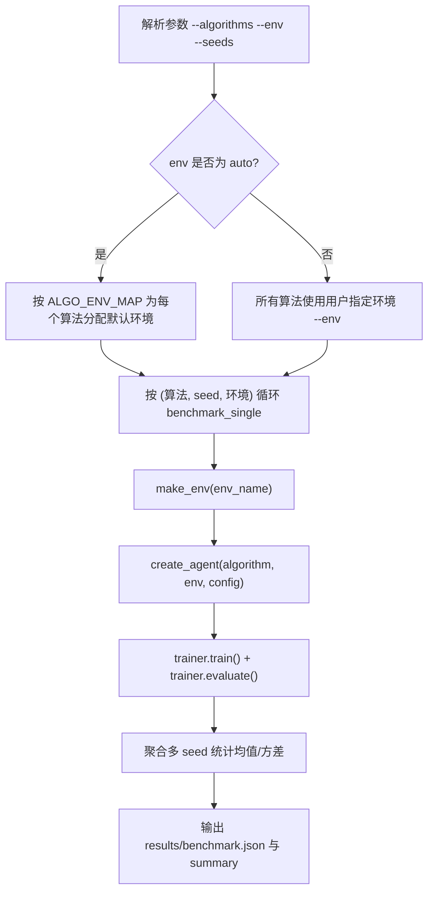

# Benchmark 流程图（含 `--env` 分支）

> 适用场景: 汇报“对比实验如何保证公平、参数如何生效”

## 与代码对齐点

- `run_benchmark` 将 `env_name` 传入 `benchmark_single`。
- `benchmark_single` 优先使用传入环境，否则回落到 `ALGO_ENV_MAP`。

## 维护说明

- 每次改 benchmark 参数语义时，先改代码，再改此图中判定节点。
