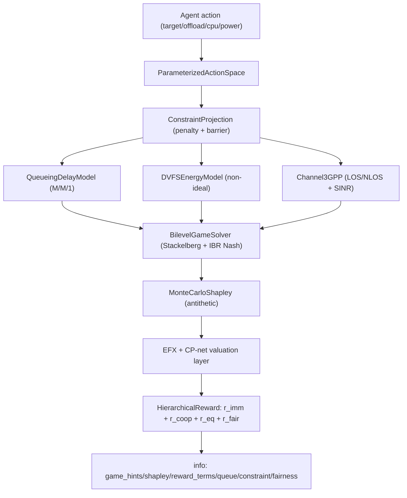

# Environment Models (GameTheory MEC)

## Notes

- External API is unchanged: same env IDs and adapter action spaces.
- `fairness_metrics` is additive info output, not a breaking change.
- EFX can be disabled via `game_theory.efx_enabled=false`.
- CP-net valuation can be disabled via `game_theory.cpnet_enabled=false`.
