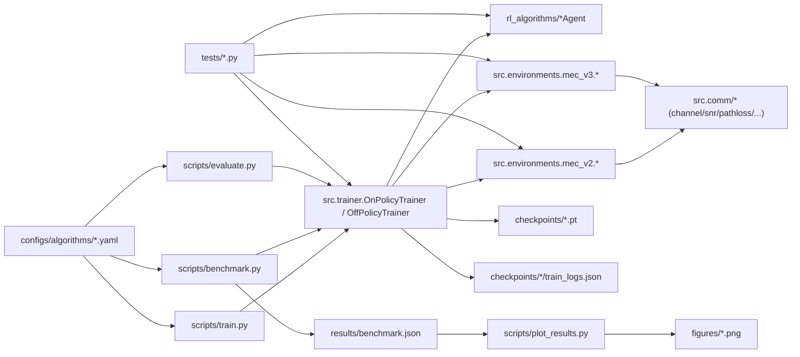

# 系统结构图（维护版）

> 适用场景: 导师快速理解“模块边界 + 数据流 + 责任分层”

```mermaid
flowchart LR
    A["configs/algorithms/*.yaml"] --> B["scripts/train.py"]
    A --> C["scripts/benchmark.py"]
    A --> D["scripts/evaluate.py"]

    B --> E["src.trainer.OnPolicyTrainer / OffPolicyTrainer"]
    C --> E
    D --> E

    E --> F["rl_algorithms/*Agent"]
    E --> G["src.environments.mec_v2.*"]
    E --> H["src.environments.mec_v3.*"]

    G --> I["src.comm/* (channel/snr/pathloss/...)"]
    H --> I

    E --> J["checkpoints/*.pt"]
    E --> K["checkpoints/*/train_logs.json"]
    C --> L["results/benchmark.json"]
    L --> M["scripts/plot_results.py"]
    M --> N["figures/*.png"]

    O["tests/*.py"] --> E
    O --> F
    O --> G
    O --> H
```

## 维护说明

- 新增模块时只加一条边，不改整图。
- 节点命名用“路径 + 角色”格式，便于代码检索。
- 不在图中写算法细节，细节放汇报正文。
