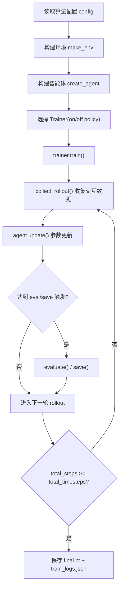

# 训练流程图（维护版）

> 适用场景: 汇报“训练链路是否闭环、责任是否清晰”

```mermaid
flowchart TD
    A["读取算法配置 config"] --> B["构建环境 make_env"]
    B --> C["构建智能体 create_agent"]
    C --> D["选择 Trainer(on/off policy)"]
    D --> E["trainer.train()"]

    E --> F["collect_rollout() 收集交互数据"]
    F --> G["agent.update() 参数更新"]
    G --> H{"达到 eval/save 触发?"}
    H -- "是" --> I["evaluate() / save()"]
    H -- "否" --> J["进入下一轮 rollout"]
    I --> J

    J --> K{"total_steps >= total_timesteps?"}
    K -- "否" --> F
    K -- "是" --> L["保存 final.pt + train_logs.json"]
```

## 维护说明

- 只维护“控制流程”，不维护每个算法内部数学细节。
- 若新增 callback、early-stop，只在判定节点追加分支。
